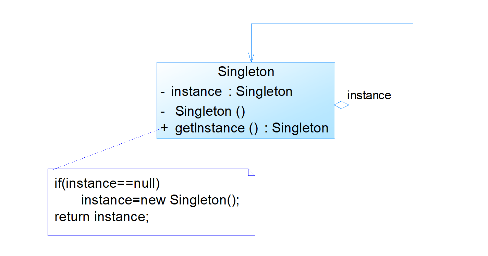
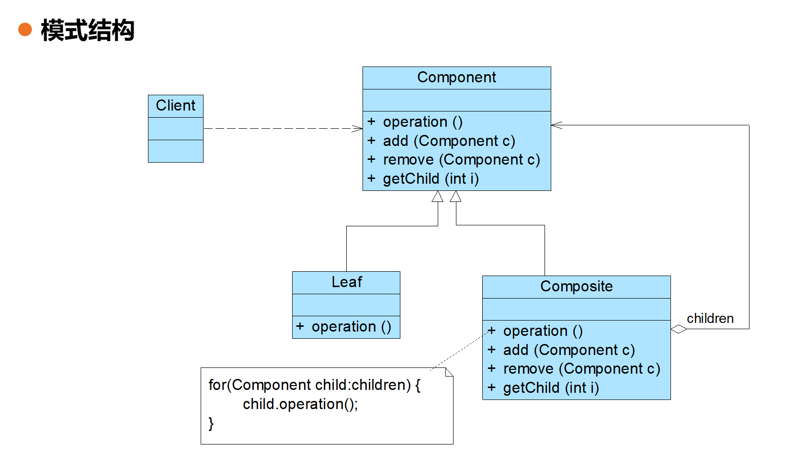
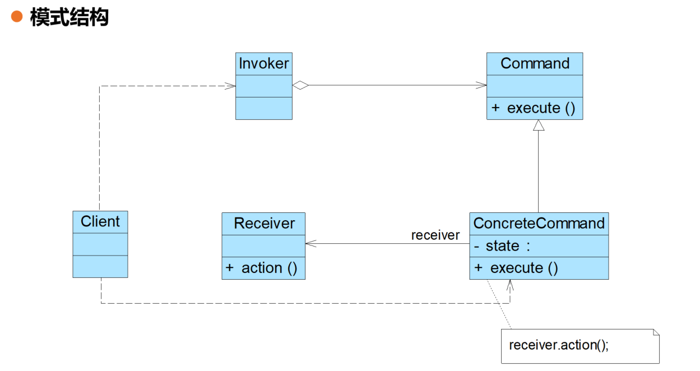

📅 **时间**: 17:22  
🌤️ **天气**: 银川 19~31℃ 晴

> 袨服华妆着处逢，六街灯火闹儿童。

<cite style="text-align: right; display: block;">— 元好问 · 《京都元夕》</cite>

## 面向对象设计原则概述 

### 常见的 **面向对象设计五大基本原则（SOLID）**：

| 英文缩写  | 中文名称        | 通俗解释                 |
| ----- | ----------- | -------------------- |
| **S** | 单一职责原则（SRP） | 一个类只做一件事，有一个明确的职责    |
| **O** | 开闭原则（OCP）   | 对扩展开放，对修改关闭          |
| **L** | 里氏替换原则（LSP） | 子类必须能替代父类            |
| **I** | 接口隔离原则（ISP） | 接口要小而精，别让类实现不需要的功能   |
| **D** | 依赖倒置原则（DIP） | 高层模块不依赖底层模块，依赖抽象（接口） |

| 设计原则名称                                        | 定 义                                                               | 解释                                                                                                                                                                                              |
| --------------------------------------------- | ----------------------------------------------------------------- | ----------------------------------------------------------------------------------------------------------------------------------------------------------------------------------------------- |
| 单一职责原则 (Single Responsibility Principle, SRP) | 一个对象应该只包含一个职责，并且该职责被完整地封装在一个类中                                    | **就像是一个专业化的厨师。** 这个厨师只会炒菜，而且他炒菜的技术特别好，所有的炒菜秘方都在他这里。他不会同时还负责洗碗、扫地，那样他可能菜也炒不好。每个类（软件单位）只干好一件事。                                                                                                    |
| 开闭原则 (Open-Closed Principle, OCP)             | 软件实体应当对扩展开放，对修改关闭                                                 | 你的软件**就像一个插座。** 我想用吹风机（新功能）插上去就能用，插座不用去改造或拆开。但插座本身（现有代码）不用因为我插了吹风机就去修改它的结构。也就是：**加新功能时，改动越少越好，最好是不用改。**                                                                                         |
| 里氏替换原则 (Liskov Substitution Principle, LSP)   | 所有引用基类的地方必须能透明地使用其子类的对象（正方形不是长方形，继承确保超类所拥有的性质在子类中仍然成立。）           | **就像“A 型号的笔可以替换 B 型号的笔”**。如果有一个地方需要一支“水笔”（基类），那么任何“水笔的子类”（比如“圆珠笔”、“钢笔”、“中性笔”）都应该能顺利地放进去，而且不会让笔写不出字或行为异常。简单说：**子类能完全替代父类，而且不影响程序正常运行。**                                                          |
| 依赖倒转原则 (Dependence Inversion Principle, DIP)  | 高层模块不应该依赖低层模块，它们都应该依赖抽象。抽象不应该依赖于细节，细节应该依赖于抽象（要面向接口编程，不要面向实现编程）    | **就像公司里的“老板”和“员工”**。老板（高层）不直接管具体哪个员工（低层）用什么工具干活，而是发布一个**“职位要求”**（抽象，比如“我需要一个能处理数据的员工”）。员工（低层）去应聘和实现这个职位要求。这样，老板（高层）和员工（低层）都依赖于这个“职位要求”（抽象），老板的业务流程就不会因为员工变动而大改。**核心是：大家都依赖“约定”（接口），而不是“具体实现”。** |
| 接口隔离原则 (Interface Segregation Principle, ISP) | 客户端不应该依赖那些它不需要的接口（要为各个类建立它们需要的专业接口）                               | **就像餐厅里的“菜单”**。你只是想点个汉堡，餐厅就不应该给你一份包含所有菜品（中餐、西餐、日料、甜点、饮品）的“巨无霸”菜单。而是应该给你一份**“快餐菜单”**。这样你（客户端）只拿到你真正需要的、小而精的“专业菜单”，不会被不需要的信息干扰。**核心是：接口要小而精，一个功能一个接口，别搞“万能接口”。**                                  |
| 合成复用原则 (Composite Reuse Principle, CRP)       | 优先使用对象组合，而不是继承来达到复用的目的                                            | **就像你想要“飞翔的能力”**。不要通过**基因改造**（继承）让自己长出翅膀，因为一旦长出来就很难摘掉或换。而应该去**买一架飞机**（组合），你“拥有”飞机，想飞的时候坐进去，不想飞就下来，也可以随时换架更先进的飞机。你的身体（主体）是独立的。**核心是：通过“拥有/包含”其他对象来获得功能，而不是通过“变成”其他对象。这样更灵活，更易变。**                |
| 迪米特法则 (Law of Demeter, LoD)                   | 每一个软件单位对其他的单位都只有最少的知识，而且局限于那些与本单位密切相关的软件单位（只与你的直接朋友交谈，不跟“陌生人”说话。） | **就像你想要“让小狗坐下”。** 你不应该通过：“你→朋友→训狗师→牵引绳→小狗”这样一长串的“陌生人”链条来传递指令。而应该**直接告诉你的小狗**：“坐下！”。也就是说，一个对象应该只和它的**“直接朋友”**（比如自己的成员变量、方法的参数、自己创建的对象）打交道，不要打探别人家的内部细节。**核心是：减少不必要的依赖，避免“牵一发而动全身”。**             |

### 类之间的关系:

| 关系名称                | 图标描述                                | 含义                                                                                         | 举例设计模式                             |
| ------------------- | ----------------------------------- | ------------------------------------------------------------------------------------------ | ---------------------------------- |
| 关联 (Association)    | 实线 + 普通开放箭头 (从A指向B)                 | 两个类之间有联系，一个类通常需要知道并使用另一个类。它们的关系比较“熟”，但不是你中有我，我中有你那种。                                       | 观察者模式、策略模式、状态模式                    |
| 依赖 (Dependency)     | 虚线 + 普通开放箭头 (从A指向B)                 | 一个类在某个方法里临时用到另一个类（比如把它作为参数，或者在方法内部创建并使用），用完就“忘”了。关系比较弱，像“临时借用”。                            | 命令模式、工厂方法模式、策略模式                   |
| 泛化 (Generalization) | 实线 + 空心三角形箭头 (从子类指向父类)              | **“是”**的关系。子类“是”父类的一种特殊类型，它继承了父类的所有特性，并可以添加或修改自己的行为。                                       | 模板方法模式（子类继承并实现父类的抽象方法）、策略模式、工厂方法模式 |
| 实现 (Realization)    | 虚线 + 空心三角形箭头 (从实现类指向接口)             | 类完全遵循并**实现**了一个接口所定义的所有功能。就像“一个厨师（类）按照食谱（接口）来做菜”。                                          | 策略模式、观察者模式、适配器模式                   |
| 聚合 (Aggregation)    | 实线 + 空心菱形 (在整体类一端) + 普通开放箭头 (指向部分类) | “包含”关系的一种。一个整体由多个部分组成，但这些部分可以独立存在，它们的生命周期不完全依赖于整体。比如“学校”包含“老师”，老师可以从一个学校离开去另一个学校。          | 组合模式（但组合模式更常用“组合”关系，聚合是较弱的拥有关系）    |
| 组合 (Composition)    | 实线 + 实心菱形 (在整体类一端) + 普通开放箭头 (指向部分类) | “包含”关系中最强的一种。一个整体由多个部分组成，而且这些部分不能独立存在，它们的生命周期与整体严格绑定。整体没了，部分也跟着没了。比如“人”和“心脏”，心脏不能脱离人而独立存在。 | 组合模式（整体与部分的强绑定）、装饰器模式              |
|                     |                                     |                                                                                            |                                    |

## 1
#### 开闭原则
- 开闭原则由Bertrand Meyer于1988年提出
- 在开闭原则的定义中，软件实体可以是一个软件模块、一个由多个类组成的局部结构或一个独立的类
- 开闭原则是指软件实体应尽量在不修改原有代码的情况下进行扩展
- 
- 
#### 简单工厂模式


将对象的创建和对象本身业务处理分离可以降低系统的耦合度，使得两者修改起来都相对容易
在调用工厂类的工厂方法时，由于工厂方法是**静态方法**，使用起来很方便，可通过工厂类类名直接调用，只需要传入一个简单的参数即可，无须知道对象的创建细节
问题：工厂类的职责相对过重，增加新的产品需要修改工厂类的判断逻辑，违背**开闭原则**
简单工厂模式就是**定义一个专门的类（工厂）**，这个类**负责创建其他类的实例**。你只需要告诉这个工厂你想要什么，它就会帮你“生产”出来，而你不用关心具体是怎么生产的。
简单工厂模式，就像一个**代购**。
你（客户端）想要一个东西（比如：披萨），但你不想自己动手做。
这时，你就找到一个**专门做披萨的代购（工厂）**。
你告诉代购：“我要海鲜披萨。” 代购就把海鲜披萨做好给你。 
你告诉代购：“我要培根披萨。” 代购就把培根披萨做好给你。
**核心思想就三句话：**
- **一个专门的“生产线”** (工厂类)。
- **你告诉它你想要什么** (传入参数)。
- **它把你要的东西“生产”出来给你** (返回实例)。

#### 工厂方法模式


简单工厂模仿违反==开闭原则==(扩展尽量不修改)


**核心要点**
1. **分工明确**：每个产品都有自己的专属工厂，职责单一。
2. **易于扩展（开闭原则）**：新增一种产品，只需增加一个新产品类和一个新的专属工厂，不改动现有代码。
3. **增加了类的数量和复杂度**：产品一多，工厂类也会跟着多起来，代码结构会更复杂。
缺点:
 - **类多且复杂：** 每增加一种产品，你不仅要加产品类，还要加对应的工厂类，导致系统中的类**数量暴增**，整体结构**更复杂**。
 -  **客户端依然要选工厂：** 客户端代码虽然不用直接创建产品，但它仍需要知道并选择**具体是哪个工厂**来创建产品，没有完全解除与具体类的耦合。
**一句话总结：** 工厂方法模式就是“**一个产品一个工厂**”，实现产品创建的解耦和系统扩展性。

#### 单例模式
单例模式的要点有三个：
- 某个类只能有一个实例
- 必须自行创建这个实例
- 必须自行向整个系统提供这个实例
- 
- 
饿汉式单例类
```java
public class EagerSingleton { 
    private static final EagerSingleton instance = new EagerSingleton(); 
    private EagerSingleton() { } 
 
    public static EagerSingleton getInstance() {
        return instance; 
    }
}

```
**饿汉式：** **程序启动就创建**，简单直接，**绝对线程安全**，但可能浪费资源。

懒汉式单例类
```java
public class LazySingleton {
    // 1. 私有化构造函数
    private LazySingleton() {}

    // 2. 声明实例，但不立即创建
    private static LazySingleton instance = null;

    // 3. 提供公共静态方法获取实例
    public static LazySingleton getInstance() {
        // 第一次调用时才创建实例
        if (instance == null) {
            instance = new LazySingleton();
        }
        return instance;
    }
}
```
**懒汉式：** **用到才创建**，节约资源，但**需要额外处理线程安全**（通常会牺牲一些性能）。

饿汉式单例类：无须考虑多个线程同时访问的问题；调用速度和反应时间优于懒汉式单例；资源利用效率不及懒汉式单例；系统加载时间可能会比较长
懒汉式单例类：实现了延迟加载；必须处理好多个线程同时访问的问题；需通过双重检查锁定等机制进行控制，将导致系统性能受到一定影响
```java
public class LazySingleton { 
private static LazySingleton instance = null; 
 
private LazySingleton() { } 
 
synchronized public static LazySingleton getInstance() { 
if (instance == null) {
instance = new LazySingleton(); 
        }
return instance; 
}
}
```
synchronized

#### 桥接模式：
把“变化”拆开，再灵活组装

桥接模式就像一座桥，它的作用是把两个经常**独立变化**的东西（维度）**分离开来**，然后让你能**自由地组合**它们。

---
理解
想象你要做一杯饮品：有**不同的口味**（咖啡、茶、果汁），和**不同的杯型**（大杯、中杯、小杯）。

**没有桥接模式，你可能会做：**
- 大杯咖啡
- 中杯咖啡
- 小杯咖啡
- 大杯茶
- 中杯茶
- ...

这样，每增加一个口味或一个杯型，你的组合就会**爆炸式增长**。

**有了桥接模式，你会怎么做？**

1. **把“口味”和“杯型”这俩维度拆开：**
    - **口味（抽象部分）：** 定义一个“饮品”接口，有咖啡、茶、果汁等具体实现。
    - **杯型（实现部分）：** 定义一个“杯子”接口，有大杯、中杯、小杯等具体实现。
2. **用“桥”连接：** 在“饮品”接口里，不再直接绑定具体的杯型，而是**持有一个“杯子”的引用**。这个引用就是我们的“桥”。

现在，你想要**大杯咖啡**，就拿**咖啡**（口味）和**大杯**（杯型）组合；想要**小杯果汁**，就拿**果汁**和**小杯**组合。

---
核心思想
- **分离：** 把一个事物的**“高层抽象”（做什么）** 和它的**“底层实现”（怎么做）** 完全分离开来。
- **桥接：** 高层抽象通过持有一个对底层实现的**引用**来“连接”它们。

---
优点 & 缺点

- **优点：**
    - **超级灵活：** 两个维度可以**独立变化和扩展**，互相不影响。
    - **减少代码：** 避免了组合爆炸导致的类数量过多和代码冗余。
- **缺点：**
    - **初期理解复杂：** 刚开始看这种模式，可能会觉得多了一层抽象，有点绕。
**一句话总结：** 桥接模式就是**“解耦两个独立变化的维度**，让它们可自由组合和扩展”**。

- 现需要提供大中小3种型号的画笔，能够绘制5种不同颜色，如果使用蜡笔，我们需要准备3*5=15支蜡笔，也就是说必须准备15个具体的蜡笔类。而如果使用毛笔的话，只需要3种型号的毛笔，外加5个颜料盒，用3+5=8个类就可以实现15支蜡笔的功能。本实例使用桥接模式来模拟毛笔的使用过程。
- 
- 
- 桥接模式包含如下角色：
- Abstraction：抽象类
- RefinedAbstraction：扩充抽象类
- Implementor：实现类接口
- ConcreteImplementor：具体实现类
#### 组合模式

组合模式包含如下角色：
- Component: 抽象构件
- Leaf: 叶子构件
- Composite: 容器构件

- 
- 


#### 外观模式

外观模式包含如下角色：
- Facade: 外观角色
- SubSystem:子系统角色
 
```java
public class Client { // 客户端类，可以是程序的任何一部分
    public static void main(String[] args) {
        // 1. 创建 Facade 类的实例（也就是那个“总开关”或“前台接待”）
        Facade facade = new Facade();

        // 2. 调用 Facade 实例的 method() 方法
        // 这一步就触发了 Facade 内部对 SubSystemA, SubSystemB, SubSystemC 的一系列调用
        System.out.println("客户端开始调用外观模式的简化方法...");
        facade.method(); // <--- 这里就是调用！
        System.out.println("外观模式方法调用完成。");
    }
}

// SubSystemA, SubSystemB, SubSystemC 定义：
class SubSystemA {
    public void method() {
        System.out.println("子系统A执行操作。");
    }
}

class SubSystemB {
    public void method() {
        System.out.println("子系统B执行操作。");
    }
}

class SubSystemC {
    public void method() {
        System.out.println("子系统C执行操作。");
    }
}

// Facade 类
public class Facade {
    private SubSystemA obj1 = new SubSystemA();
    private SubSystemB obj2 = new SubSystemB();
    private SubSystemC obj3 = new SubSystemC();

    public void method() {
        System.out.println("Facade: 协调子系统操作开始。");
        obj1.method();
        obj2.method();
        obj3.method();
        System.out.println("Facade: 协调子系统操作结束。");
    }
}
```


#### 命令模式
命令模式包含如下角色：
- Command: 抽象命令类
- ConcreteCommand: 具体命令类
- Invoker: 调用者
- Receiver: 接收者
- `execute()` 是命令的**执行入口**，它定义了“做什么”。
- `state :` 是命令的**状态或参数**，它定义了“用什么（数据）来做”或者“做了什么（以便撤销）”。
- 
模式分析
- 将请求发送者和接收者完全解耦
- 发送者与接收者之间没有直接引用关系
- 发送请求的对象只需要知道如何发送请求，而不必知道如何完成请求
- 命令模式的本质是对请求进行封装
- 一个请求对应于一个命令，将发出命令的责任和执行命令的责任分开

- 电视机是请求的接收者，遥控器是请求的发送者，遥控器上有一些按钮，不同的按钮对应电视机的不同操作。抽象命令角色由一个命令接口来扮演，有三个具体的命令类实现了抽象命令接口，这三个具体命令类分别代表三种操作：打开电视机、关闭电视机和切换频道。显然，电视机遥控器就是一个典型的命令模式应用实例。
- 


